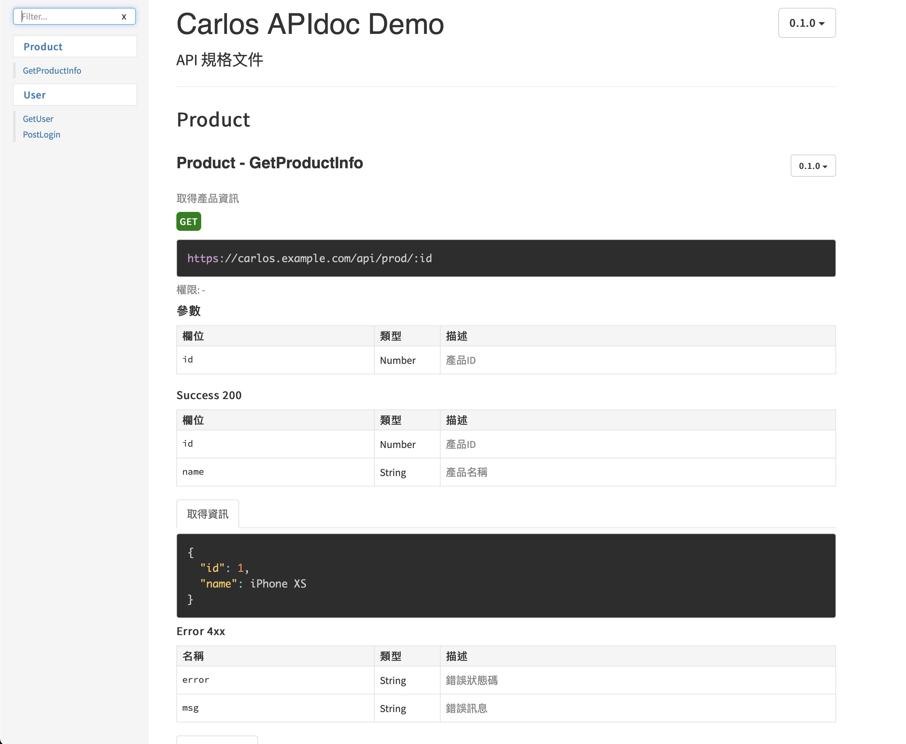

<!-- Title & Logo -->
<h1 align="center">APIdoc example</h1>

<!-- tag & links (Version\Lang\Package) -->
<p align="center">
    
    
</p>
<p align="center">
    Source：<a href="https://github.com/evilz0212/ex-js-apidoc">Github</a> ｜ 
	Demo：<a href="https://evilz0212.github.io/ex-js-apidoc/">Git Pages</a>
<p>

<!-- Overview (Preview\Purpose\Description) -->


## Overview
> JS 編寫 API 規格文件網頁
#### Target
1. API 規格文件
   - RESTful API 設計準則
   - 即時測試 API 請求回應
   - 可模組化管理
   - 可版本控制

#### Detail
-  apidoc (以JS註解產出規格文件)
-  gaze (監視更動自動編譯)

<!-- Get started (Install\Step) -->
## Get started
#### Requirements
1. Node.js 14.15
2. npm 6.14
#### Installation
1. install npm packages
   ```
   npm install
   npm i -g apidoc gaze
   ```
2. run build apidoc
   ```
   npm run build
   ```
3. open ```doc/index.html``` with browser

#### Auto Rebuild
1. watch apidoc
   ```
   npm run dev
   ```

## Refer
* [apiDoc - Github](https://github.com/apidoc/apidoc)
* [apiDoc - document](https://apidocjs.com)

<!-- Partner -->

<!-- License -->
